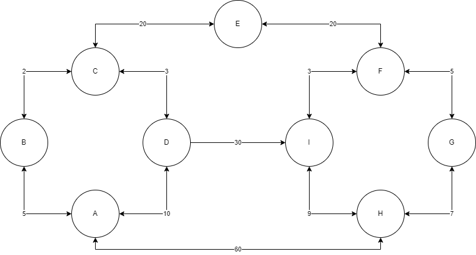

# Simulatore di Distance Vector Routing
## Documentazione del Progetto

### Indice
1. [Introduzione](#1-introduzione)
2. [Struttura del Progetto](#2-struttura-del-progetto) \
     2.1 [main](#21-mainpy) \
     2.2 [node](#22-componentsnodepy) \
     2.3 [network](#23-componentsnetworkpy)
3. [Implementazione](#3-implementazione) \
     3.1 [Gestione dei nodi](#31-gestione-dei-nodi) \
     3.2 [Algoritmo di routing](#32-algoritmo-di-routing) \
     3.3 [Simulazione del ping](#33-simulazione-del-ping)
4. [Test e Risultati](Test_e_Risultati) \
     4.1 [Tabelle di routing](#41-tabelle-di-routing) \
     4.2 [Percorso ottimale](#42-percorso-ottimale)
5. [Conclusioni](Conclusioni)

### 1. Introduzione

Questo progetto implementa un simulatore del protocollo Distance Vector Routing in Python. Il simulatore esegue le seguenti operazioni:
- Crea una rete di nodi interconnessi
- Simula lo scambio di tabelle di routing tra i nodi
- Calcola i percorsi ottimali tra i nodi
- Simula l'invio di ping tra due nodi qualsiasi

La rete implementata è composta da 9 nodi (da A a I) interconnessi tra loro con collegamenti bidirezionali di costo variabile.



### 2. Struttura del Progetto
La soluzione del progetto può essere trovata a partire dalla cartella `src`. \
Il codice del progetto è organizzato in tre file principali:

#### 2.1 main.py
File principale che contiene la logica di inizializzazione della rete e l'esecuzione della simulazione. Si occupa di:
- Creare l'istanza della rete
- Aggiungere i nodi alla rete
- Definire i collegamenti tra i nodi con i relativi costi
- Avviare la simulazione
- Visualizzare i risultati

#### 2.2 components/Node.py
Implementa la classe `Node` che rappresenta un singolo nodo della rete. Ogni nodo mantiene:
- Il proprio identificativo univoco
- La tabella di routing
- Lista dei vicini con i relativi costi

#### 2.3 components/Network.py
Implementa la classe `Network` che gestisce l'intera rete e coordina:
- L'aggiunta di nodi e collegamenti
- La simulazione del protocollo di routing
- La visualizzazione delle tabelle di routing
- La simulazione dei ping tra nodi

### 3. Implementazione

#### 3.1 Gestione dei Nodi
Ogni nodo della rete è rappresentato da un'istanza della classe `Node`. La tabella di routing di ciascun nodo è implementata come un dizionario Python dove:
- Le chiavi sono gli identificativi dei nodi destinazione
- I valori sono tuple (costo, next_hop) che rappresentano:
  - Il costo totale per raggiungere la destinazione
  - Il prossimo nodo nel percorso verso la destinazione

#### 3.2 Algoritmo di Routing
L'implementazione del Distance Vector Routing segue questi passaggi:
1. Inizializzazione delle tabelle di routing con i vicini diretti
2. Scambio iterativo delle tabelle tra nodi adiacenti
3. Aggiornamento delle tabelle quando viene trovato un percorso migliore
4. Convergenza quando non ci sono più aggiornamenti da effettuare

Il codice implementa l'algoritmo di Bellman-Ford distribuito, dove ogni nodo:
- Mantiene le distanze verso tutte le destinazioni
- Scambia periodicamente la propria tabella con i vicini
- Aggiorna i costi quando trova percorsi migliori

#### 3.3 Simulazione del Ping
La funzionalità di ping è implementata della classe `Network` e permette di:
- Simulare l'invio di un pacchetto tra due nodi
- Tracciare il percorso seguito dal pacchetto
- Calcolare il costo totale del percorso

### 4. Test e Risultati

Il simulatore è stato testato sulla rete mostrata ed illustrata precedentemente (9 nodi) con i seguenti risultati:
- Viene raggiunta la convergenza delle tabelle di routing
- Le tabelle di routing mostrano i percorsi ottimali tra tutti i nodi
- La funzionalità di ping verifica correttamente i percorsi calcolati

#### 4.1 Tabelle di routing
Dopo una prima fase di scambio delle tabelle di routing i risultati sono i seguenti
```
Tabella di routing per il nodo A:
Destinazione | Costo | Next Hop
-----------------------------------
     A       |   0   |    A    
     B       |   5   |    B    
     C       |   7   |    B    
     D       |  10   |    D    
     E       |  27   |    B    
     F       |  43   |    D    
     G       |  48   |    D    
     H       |  49   |    D    
     I       |  40   |    D    

Tabella di routing per il nodo B:
Destinazione | Costo | Next Hop
-----------------------------------
     A       |   5   |    A    
     B       |   0   |    B    
     C       |   2   |    C    
     D       |   5   |    C    
     E       |  22   |    C    
     F       |  38   |    C    
     G       |  43   |    C    
     H       |  44   |    C    
     I       |  35   |    C    

Tabella di routing per il nodo C:
Destinazione | Costo | Next Hop
-----------------------------------
     A       |   7   |    B    
     B       |   2   |    B    
     C       |   0   |    C    
     D       |   3   |    D    
     E       |  20   |    E    
     F       |  36   |    D    
     G       |  41   |    D    
     H       |  42   |    D    
     I       |  33   |    D    

Tabella di routing per il nodo D:
Destinazione | Costo | Next Hop
-----------------------------------
     A       |  10   |    A    
     B       |   5   |    C    
     C       |   3   |    C    
     D       |   0   |    D    
     E       |  23   |    C    
     F       |  33   |    I    
     G       |  38   |    I    
     H       |  39   |    I    
     I       |  30   |    I    

Tabella di routing per il nodo E:
Destinazione | Costo | Next Hop
-----------------------------------
     A       |  27   |    C    
     B       |  22   |    C    
     C       |  20   |    C    
     D       |  23   |    C    
     E       |   0   |    E    
     F       |  20   |    F    
     G       |  25   |    F    
     H       |  32   |    F    
     I       |  23   |    F    

Tabella di routing per il nodo F:
Destinazione | Costo | Next Hop
-----------------------------------
     A       |  43   |    I    
     B       |  38   |    I    
     C       |  36   |    I    
     D       |  33   |    I    
     E       |  20   |    E    
     F       |   0   |    F    
     G       |   5   |    G    
     H       |  12   |    G    
     I       |   3   |    I    

Tabella di routing per il nodo G:
Destinazione | Costo | Next Hop
-----------------------------------
     A       |  48   |    F    
     B       |  43   |    F    
     C       |  41   |    F    
     D       |  38   |    F    
     E       |  25   |    F    
     F       |   5   |    F    
     G       |   0   |    G    
     H       |   7   |    H    
     I       |   8   |    F    

Tabella di routing per il nodo H:
Destinazione | Costo | Next Hop
-----------------------------------
     A       |  49   |    I    
     B       |  44   |    I    
     C       |  42   |    I    
     D       |  39   |    I    
     E       |  32   |    G    
     F       |  12   |    G    
     G       |   7   |    G    
     H       |   0   |    H    
     I       |   9   |    I    

Tabella di routing per il nodo I:
Destinazione | Costo | Next Hop
-----------------------------------
     A       |  40   |    D    
     B       |  35   |    D    
     C       |  33   |    D    
     D       |  30   |    D    
     E       |  23   |    F    
     F       |   3   |    F    
     G       |   8   |    F    
     H       |   9   |    H    
     I       |   0   |    I   
```

#### 4.2 Percorso ottimale
Dopo aver eseguito il ping dal nodo 'A' al nodo 'H' il risultato è il seguente
```
ping from A to H, A -> D -> I -> H, count: 49
```
Questo indica che:
- Il pacchetto attraversa 4 nodi
- Il costo totale del percorso è 97

### 5. Conclusioni

Il progetto implementa con successo una simulazione funzionante del protocollo Distance Vector Routing, dimostrando:
- La corretta convergenza dell'algoritmo
- La capacità di trovare i percorsi ottimali
- La possibilità di tracciare i pacchetti attraverso la rete

L'implementazione è facilmente estendibile per:
- Aggiungere nuovi nodi e collegamenti
- Simulare diverse topologie di rete